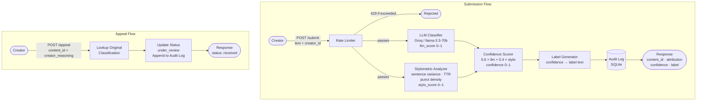

# Provenance Guard - Planning Document

### Architecture Narrative

When a creator submits a piece of text to Provenance Guard, here's the full path it takes:

1. **POST /submit** receives a JSON body with `text` and `creator_id`. Flask validates the request and rate-limiting middleware checks whether this IP/user has hit their quota. If they have, the request is rejected with 429 before anything else runs.

2. The text is handed to the **Detection Pipeline**, which runs two independent signals:
   - **Signal 1 - LLM Classifier (Groq)**: the raw text is sent to `llama-3.3-70b-versatile` with a structured prompt asking it to assess whether the writing reads as human or AI-generated. The model returns a probability score (0–1, where 1 = almost certainly AI).
   - **Signal 2 - Stylometric Analyzer**: a pure-Python function computes three statistical properties of the text, sentence length variance, type-token ratio (vocabulary diversity), and punctuation density. These are combined into a single stylometric score (0–1, where 1 = AI-like uniformity).

3. Both signal scores are fed into the **Confidence Scorer**, which applies a weighted combination (60% LLM, 40% stylometric) to produce a single `confidence` value between 0 and 1. This value represents confidence that the content is AI-generated.

4. The confidence score is passed to the **Label Generator**, which maps it to one of three transparency label variants and returns the exact label text.

5. A structured entry is written to the **Audit Log** (SQLite) capturing the timestamp, content ID, creator ID, both signal scores, combined confidence, attribution result, and status.

6. The endpoint returns a JSON response with: `content_id`, `attribution`, `confidence`, and `label`.

For the **appeal flow**:

1. **POST /appeal** receives a `content_id` and `creator_reasoning`.
2. The system looks up the original classification in the audit log / content store.
3. Status is updated to `"under_review"` and the appeal reasoning is appended to the log entry.
4. A confirmation response is returned. No automated re-classification happens, a human reviewer would triage from the log.

---

### Detection Signals Initial Plan Idea

#### Signal 1: LLM-Based Classification (Groq)

**What it measures**: Semantic and stylistic coherence holistically. The model has internalized what AI-generated text "feels like", the tendency toward balanced hedging, generic phrasing, unnaturally smooth transitions, and a certain kind of confident completeness that human writing rarely has.

**Why it differs between human and AI writing**: AI models are trained on vast corpora to produce fluent, coherent text that satisfies a prompt. That optimization pressure produces text that is structurally predictable even when it's topically diverse. A human writer has personality, inconsistency, emotional register shifts, tangents, things that don't emerge from next-token prediction.

**Blind spots**: It will struggle with human writing that deliberately mimics AI style (corporate communications, academic boilerplate). It can also misfire on highly polished, edited human prose because polish looks like AI smoothness. It won't catch AI text that's been lightly edited by a human to introduce natural-sounding irregularities.

#### Signal 2: Stylometric Heuristics (Pure Python)

**What it measures**: Statistical structure of the text at the sentence and vocabulary level. Specifically:
- **Sentence length variance**: AI text tends to have lower variance, sentences cluster around a "comfortable" length. Human writing is spikier.
- **Type-token ratio (TTR)**: AI text reuses words at a moderate rate; very high or very low TTR is more likely human (either intentionally repetitive poetry or free-flowing stream-of-consciousness).
- **Punctuation density**: AI text tends to use punctuation conservatively and predictably. Human writing is messier.

**Why it differs between human and AI writing**: These are structural fingerprints that emerge from *how* the text was generated. A language model optimizing for coherence produces statistically smoother text almost as a side effect.

**Blind spots**: Short texts (< 50 words) produce unreliable statistics, variance metrics need a decent sample. Also, highly edited human writing (literary fiction, journalism) will score as AI-like on stylometrics because editors flatten exactly the irregularities these metrics are looking for.

---

### False Positive Scenario Trace

A non-native English speaker submits a short personal essay. Their writing is formal because English instruction tends to produce formal register, and their sentences are more uniform than a native speaker's would be because they're working within a narrower vocabulary. Stylometrics flags this as AI-like (low variance, low TTR for their active vocabulary). The LLM classifier, seeing structured sentences and a formal register, also leans toward AI.

**What happens**:
- Both signals score moderately high → combined confidence
- This is in the "uncertain" or "likely AI" zone depending on thresholds
- The label variant returned is either "Uncertain, we can't confidently determine the origin of this content" or the high-AI variant
- The creator sees the label and can immediately submit an appeal with their reasoning
- The audit log captures the full signal breakdown, so a human reviewer can see *why* it was flagged and make a judgment call

This is exactly why the appeal flow matters more than detection accuracy. The system should never claim certainty it doesn't have, and it should always give the creator an obvious path to contest a wrong call.

---

### API Surface

| Method | Endpoint | Accepts | Returns |
|--------|----------|---------|---------|
| POST | `/submit` | `{ text, creator_id }` | `{ content_id, attribution, confidence, label }` |
| POST | `/appeal` | `{ content_id, creator_reasoning }` | `{ status, message }` |
| GET | `/log` | - | `{ entries: [...] }` |

Rate limiting applies to POST `/submit` only. GET `/log` is unauthenticated.

---

### Architecture

#### Diagram



**Submission flow**: Text enters through the rate-limited `/submit` endpoint, passes through both detection signals in parallel, gets combined into a confidence score, mapped to a label, logged, and returned to the caller.

**Appeal flow**: The creator provides a `content_id` from a prior submission. The system updates that record's status to `under_review` and appends the appeal reasoning to the audit log so a human reviewer has full context.

---

### Detection Signals

#### Signal 1: LLM Classifier (Groq)

- **Output format**: a float between 0.0 and 1.0 representing the model's estimated probability that the text is AI-generated. I'll prompt the model to return a JSON object like `{"ai_probability": 0.83, "reasoning": "..."}` so I can extract the score cleanly without parsing freeform text.
- **Prompt strategy**: I'll give the model the text and ask it to evaluate stylistic markers, uniformity, hedging language, generic phrasing, transition words, and return a calibrated probability, not just a binary verdict. I'll explicitly tell it that 0.5 means genuinely uncertain, not "leaning slightly."
- **What it contributes to the combo score**: 60% weight. It's the stronger signal for catching semantically polished AI text that stylometrics would miss.

#### Signal 2: Stylometric Heuristics (Pure Python)

- **Output format**: a float between 0.0 and 1.0. Computed from three sub-metrics:
  1. **Sentence length variance score**: normalize the standard deviation of sentence word-counts. Low variance → high AI score. I'll cap the normalization at a reasonable max (e.g., stddev of 20+ words → score 0, stddev of 2 or less → score 1).
  2. **Type-token ratio (TTR) score**: unique words / total words. AI text tends to cluster in the 0.55–0.75 range. Very low TTR (repetitive poetry) or very high TTR (stream-of-consciousness) is more likely human. I'll score distance from the AI-typical range.
  3. **Punctuation density score**: punctuation marks / total characters. AI text is conservative; human writing is messier. Higher density → lower AI score.
  - The three sub-scores are averaged into a single `stylo_score`.
- **What it contributes to the combo score**: 40% weight. It's the independent structural check, catches AI text that happens to be on an unusual topic (which might fool the LLM) but still has AI's characteristic statistical smoothness.

#### Combination

```
confidence = 0.6 * llm_score + 0.4 * stylo_score
```

Both signals are independently meaningful, so a weighted average is the right approach here, no thresholding or voting needed at the signal level. The combined `confidence` is what everything else (label, audit log, attribution field) is based on.

---

### Uncertainty Representation

**What the score means**:
- `confidence` represents estimated probability that the content is AI-generated
- 0.0 = the system is highly confident this is human-written
- 1.0 = the system is highly confident this is AI-generated
- 0.5 = genuinely uncertain, the signals disagree or are ambiguous

**Thresholds**:

| Range | Attribution | Label Variant |
|-------|-------------|---------------|
| 0.0 – 0.39 | `likely_human` | High-confidence human |
| 0.40 – 0.69 | `uncertain` | Uncertain |
| 0.70 – 1.0 | `likely_ai` | High-confidence AI |

I deliberately set the human threshold lower than 0.5 because a false positive (labeling a human's work as AI) is worse than a false negative on a writing platform. The system should need a stronger signal before accusing someone, not just a coin flip. A score of 0.40–0.69 lands in "uncertain" and gets the cautious label rather than an outright accusation.

**Calibration approach**: I'll test the scoring against the four reference inputs from the instructions (clearly AI, clearly human, two borderline cases) and adjust the weights or thresholds if any of them produce counterintuitive results. The target is: clearly AI text scores 0.70+, clearly human text scores below 0.40, and the borderline cases land somewhere in 0.40–0.69.

---

### Transparency Label Design

Three variants, written out exactly as the API will return them:

**High-confidence AI** (`confidence >= 0.70`):
```
AI-Assisted Content - Our system found strong signals that this content may have been
generated with AI assistance (confidence: {confidence_pct}%). This label reflects an
automated assessment, not a definitive determination. The creator can contest this
classification through the appeal process.
```

**Uncertain** (`0.40 <= confidence < 0.70`):
```
Origin Unclear - Our system couldn't confidently determine whether this content was
written by a human or generated with AI assistance (confidence: {confidence_pct}%).
Treat this content as you would any unverified post.
```

**High-confidence human** (`confidence < 0.40`):
```
Likely Human-Written - Our system found no strong signals of AI generation in this
content (confidence of AI: {confidence_pct}%). This is an automated assessment and
does not constitute a guarantee of human authorship.
```

A few design decisions worth noting:
- All three variants include the raw confidence percentage so a non-technical reader can see how certain the system actually is
- The AI label explicitly names the appeal path so creators see it immediately
- The human label includes a hedge ("does not constitute a guarantee") because overclaiming in the human direction erodes trust just as much as false AI accusations
- None of the labels say "we verified", the language is consistently probabilistic

---

### Appeals Workflow

**Who can submit**: anyone with a valid `content_id` from a prior `/submit` response. In a real system this would be gated to the original `creator_id`, but for this project I'm not implementing authentication, the `content_id` itself acts as the access token.

**What they provide**:
- `content_id` (required): the ID from the original submission
- `creator_reasoning` (required): free-text explanation of why they believe the classification is wrong, minimum 1 character, no maximum

**What the system does on appeal**:
1. Looks up the original record by `content_id` in the audit log / SQLite store
2. Returns a 404 if the `content_id` doesn't exist
3. Updates the record's `status` field from `"classified"` to `"under_review"`
4. Appends `appeal_reasoning` and `appeal_timestamp` to the log entry
5. Returns a confirmation: `{ "status": "received", "content_id": "...", "message": "Your appeal has been logged and will be reviewed." }`

**What a human reviewer sees**: a GET /log entry with `status: "under_review"`, the original `attribution`, `confidence`, both signal scores, and the `appeal_reasoning` field all in one record. Everything they need to make a judgment call is in one place, they don't need to cross-reference anything.

**What doesn't happen**: no automated re-classification, no score recalculation, no change to the label returned to users until a human manually updates the record. The system flags it; a human decides.

---

### Anticipated Edge Cases

**1. Short texts (< 50 words) - stylometrics breaks down**
A haiku, a tweet-length poem, or a single paragraph produces unreliable variance scores. With only 3–4 sentences, the standard deviation of sentence lengths has too little data to be meaningful. The stylometric signal will be noisy, which inflates or deflates the combined confidence in an unpredictable direction. My mitigation: for texts under 50 words, I'll reduce the stylometric weight to near-zero and rely more heavily on the LLM signal, or flag the result as low-reliability in the audit log.

**2. Formal academic or legal writing by humans**
A law student writing a case brief, or a researcher writing an abstract, naturally produces text that scores AI-like on every signal: hedged language, uniform sentence structure, low punctuation density, conservative vocabulary. The LLM will see "professional register" and lean toward AI; stylometrics will agree. This is the hardest false positive case and the one I'm most worried about. The confidence score will likely land in the 0.55–0.70 range, just below or inside the AI threshold, which means the label design and the appeal path are the real defenses here, not the detection.

---

### AI Tool Plan

#### M3 - Submission Endpoint + First Signal (LLM)

**Spec sections I'll provide**: Detection Signals section (Signal 1 output format + prompt strategy), the Architecture diagram, and the API surface table from M1.

**What I'll ask for**: (1) Flask app skeleton with `POST /submit` stub that returns a hardcoded response, (2) a standalone `classify_with_llm(text)` function that calls Groq and returns a float score, (3) a SQLite-backed `write_log_entry()` helper and `GET /log` endpoint.

**How I'll verify**: call `classify_with_llm()` directly on the four reference inputs from the instructions before wiring it into the endpoint. Check that clearly AI text scores higher than clearly human text. Then test the endpoint with curl and confirm the JSON shape matches the spec.

---

#### M4 - Second Signal + Confidence Scoring

**Spec sections I'll provide**: Detection Signals section (Signal 2 sub-metrics + combination formula), Uncertainty Representation section (thresholds table), and the Architecture diagram.

**What I'll ask for**: (1) standalone `analyze_stylometrics(text)` function that computes the three sub-metrics and returns a single float, (2) `compute_confidence(llm_score, stylo_score)` that applies the 0.6/0.4 weighting.

**How I'll verify**: run both signals separately on each of the four reference inputs and print both scores before combining. Check that the signals roughly agree on clear cases and that their disagreement on borderline cases pushes the combined score into the uncertain zone. If any reference input produces a score that doesn't match my intuition, I'll debug signal-by-signal before moving on.

---

#### M5 - Production Layer

**Spec sections I'll provide**: Transparency Label Design section (exact label text + thresholds), Appeals Workflow section (full behavior spec), rate limiting requirements, and the Architecture diagram.

**What I'll ask for**: (1) `generate_label(confidence)` function that returns the exact label text with the confidence percentage interpolated, (2) `POST /appeal` endpoint matching the workflow spec, (3) Flask-Limiter wiring on the submit route.

**How I'll verify**: submit inputs designed to hit all three label thresholds and confirm the returned label text matches the spec exactly. Test the appeal endpoint with a real `content_id` from a prior submission, then call `GET /log` to confirm the status updated to `under_review` and `appeal_reasoning` is populated. Run the rate-limit test loop from the instructions (12 rapid requests) and confirm the 429s appear after request 10.
